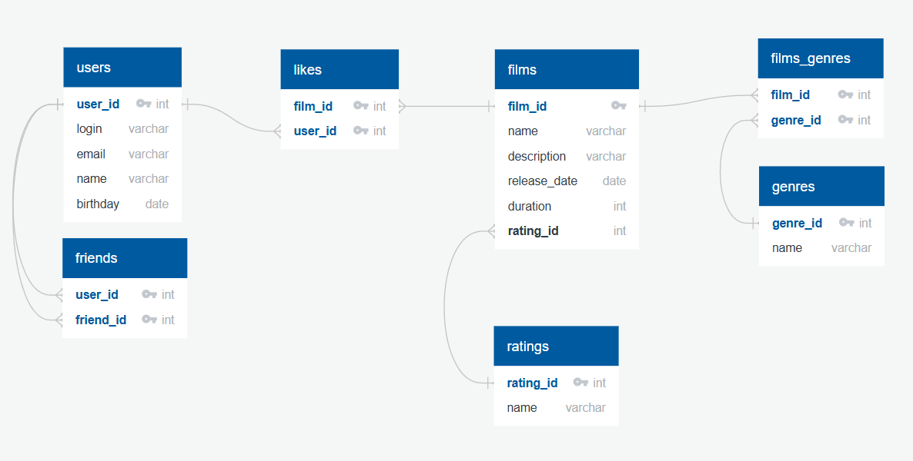

# Filmorate

## Схема базы данных



### Структура таблиц

#### 1. Таблица `users` - Пользователи

Хранит информацию о зарегистрированных пользователях.

| Колонка | Тип | Ограничения | Описание |
|---------|-----|-------------|----------|
| `user_id` | int | PRIMARY KEY, GENERATED BY DEFAULT AS IDENTITY | Уникальный идентификатор пользователя |
| `login` | varchar(50) | NOT NULL | Логин пользователя |
| `email` | varchar(50) | NOT NULL, UNIQUE | Email пользователя |
| `name` | varchar(50) | | Имя пользователя |
| `birthday` | date | | Дата рождения |

#### 2. Таблица `friends` - Друзья

Хранит связи дружбы между пользователями (многие-ко-многим).
Подразумевается, что если у пользователя А в друзьях есть пользователь Б, и в то же время у пользователя Б есть в друзьях пользователь А, то такая дружба подтверждённая. В противном случае дружба считается неподтверждённой.

| Колонка | Тип | Ограничения | Описание |
|---------|-----|-------------|----------|
| `user_id` | int | PRIMARY KEY, REFERENCES users(user_id) | ID пользователя |
| `friend_id` | int | PRIMARY KEY, REFERENCES users(user_id) | ID друга |

#### 3. Таблица `ratings` - Рейтинги

Хранит возможные рейтинги фильмов (MPAA).

| Колонка | Тип | Ограничения | Описание |
|---------|-----|-------------|----------|
| `rating_id` | int | PRIMARY KEY, GENERATED BY DEFAULT AS IDENTITY | ID рейтинга |
| `name` | varchar(30) | NOT NULL, UNIQUE | Название рейтинга (G, PG, PG-13, R, NC-17) |

#### 4. Таблица `films` - Фильмы

Хранит информацию о фильмах.

| Колонка | Тип | Ограничения | Описание |
|---------|-----|-------------|----------|
| `film_id` | int | PRIMARY KEY, GENERATED BY DEFAULT AS IDENTITY | ID фильма |
| `name` | varchar(50) | NOT NULL | Название фильма |
| `description` | varchar(200) | | Описание фильма |
| `release_date` | date | | Дата выпуска |
| `duration` | int | | Продолжительность в минутах |
| `rating_id` | int | REFERENCES ratings(rating_id) | ID рейтинга |

#### 5. Таблица `likes` - Лайки

Хранит информацию о том, какие фильмы понравились пользователям.

| Колонка | Тип | Ограничения | Описание |
|---------|-----|-------------|----------|
| `film_id` | int | PRIMARY KEY, REFERENCES films(film_id) | ID фильма |
| `user_id` | int | PRIMARY KEY, REFERENCES users(user_id) | ID пользователя |

#### 6. Таблица `genres` - Жанры

Хранит возможные жанры фильмов.

| Колонка | Тип | Ограничения | Описание |
|---------|-----|-------------|----------|
| `genre_id` | int | PRIMARY KEY, GENERATED BY DEFAULT AS IDENTITY | ID жанра |
| `name` | varchar(50) | NOT NULL | Название жанра |

#### 7. Таблица `films_genres` - Связь фильмов и жанров

Связывает фильмы с их жанрами.

| Колонка | Тип | Ограничения | Описание |
|---------|-----|-------------|----------|
| `film_id` | int | PRIMARY KEY, REFERENCES films(film_id) | ID фильма |
| `genre_id` | int | PRIMARY KEY, REFERENCES genres(genre_id) | ID жанра |

## Примеры запросов
### Пользователи
```sql
-- Получить всех пользователей
SELECT * FROM users;

-- Получить пользователя по ID
SELECT * FROM users WHERE user_id = 1;

-- Добавить нового пользователя
INSERT INTO users (login, email, name, birthday)
VALUES ('Иван Иванов', '123@example.com', 'Ванька', '1990-01-01');

-- Обновить данные пользователя
UPDATE users SET name = 'Иван Иванович Иванов', login = 'Ваня'
WHERE user_id = 1;

-- Удалить пользователя
DELETE FROM users WHERE user_id = 1;
```
### Друзья
```sql
-- Добавить друга 
INSERT INTO friends (user_id, friend_id) VALUES (1, 2);

-- Удалить из друзей
DELETE FROM friends WHERE user_id = 1 AND friend_id = 2;

-- Получить всех друзей пользователя с id = 1
SELECT * FROM users
WHERE user_id IN (
    SELECT friend_id FROM friends WHERE user_id = 1
);

-- Получить общих друзей пользователей с id = 1 и id = 2
SELECT * FROM users
WHERE user_id IN (
    SELECT friend_id FROM friends
    WHERE user_id IN (1, 2)
    GROUP BY friend_id
    HAVING COUNT(friend_id) > 1
);
```
### Фильмы
```sql
-- Получить все фильмы с рейтингами
SELECT f.*, r.name AS rating_name
FROM films f
JOIN ratings r USING (rating_id);

-- Получить фильм по Id
SELECT f.*, r.name as rating_name 
FROM films f
JOIN ratings r USING (rating_id)
WHERE f.film_id = 1;

-- Добавить фильм
INSERT INTO films (name, description, release_date, duration, rating_id) 
VALUES ('Начало', 'Идея — самый живучий паразит', '2010-07-16', 148, 3);
```
### Лайки
```sql
-- Поставить лайк фильму с id 1 от лица пользователя с id 1
INSERT INTO likes (film_id, user_id) VALUES (1, 1);

-- Удалить лайк
DELETE FROM likes WHERE film_id = 1 AND user_id = 1;

-- Получить топ-5 популярных фильмов c рейтингом
SELECT f.*, l.count, r.name AS rating_name
FROM films f
JOIN (
    SELECT film_id, COUNT(user_id) AS count
    FROM likes
    GROUP BY film_id
    ORDER BY count DESC
    LIMIT 5
) AS l USING (film_id)
JOIN ratings r USING (rating_id)
ORDER BY l.count DESC
```
### Жанры
```sql
-- Добавить жанр фильму
INSERT INTO films_genres (film_id, genre_id) VALUES (1, 1);

-- Получить все жанры фильма id = 1
SELECT fg.genre_id, g.name
FROM films_genres fg
JOIN genres g USING(genre_id)
WHERE film_id = 1;
```